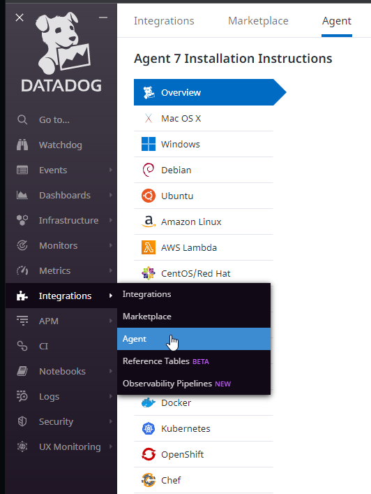

# Use Datadog to Monitor Boomi Logs and JMX metrics

## Install the Datadog Agent

The Datadog Agent will be installed after the Boomi runtime has been completely set up. The installation instructions can be found on [Datadog's documentation site](https://docs.datadoghq.com/agent/). Follow the instructions for your specific operating system.

The examples within the guide will be for RHEL 8.

To install the agent, log into Datadog and go to Integration -> Agent.

